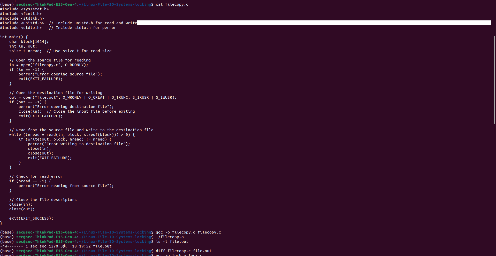
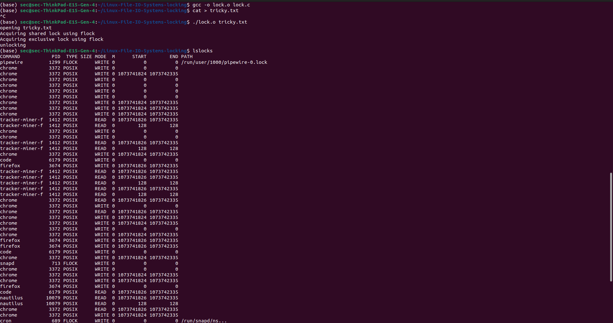
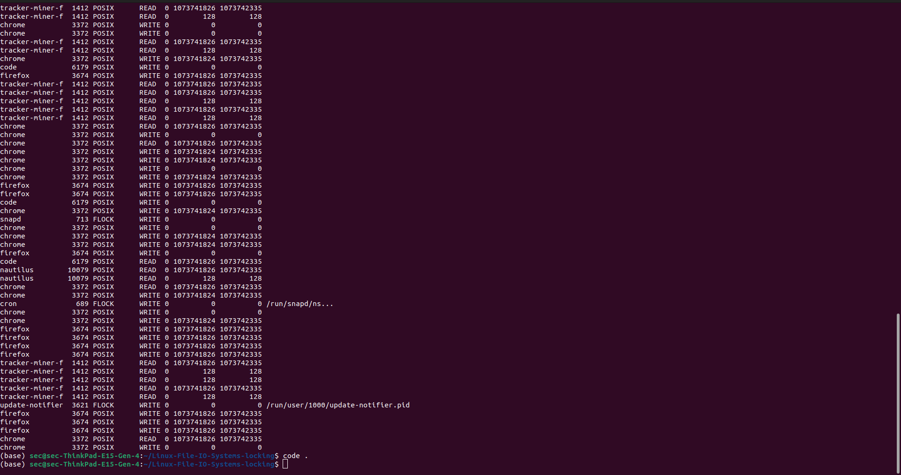

# Linux-File-IO-Systems-locking
Ex07-Linux File-IO Systems-locking
# AIM:
To Write a C program that illustrates files copying and locking

# DESIGN STEPS:

### Step 1:

Navigate to any Linux environment installed on the system or installed inside a virtual environment like virtual box/vmware or online linux JSLinux (https://bellard.org/jslinux/vm.html?url=alpine-x86.cfg&mem=192) or docker.

### Step 2:

Write the C Program using Linux IO Systems locking

### Step 3:

Execute the C Program for the desired output. 

# PROGRAM:

## 1.To Write a C program that illustrates files copying 

```
#include <sys/stat.h>
#include <fcntl.h>
#include <stdlib.h>
#include <unistd.h>  // Include unistd.h for read and write
#include <stdio.h>   // Include stdio.h for perror

int main() {
    char block[1024];
    int in, out;
    ssize_t nread;  // Use ssize_t for read size

    // Open the source file for reading
    in = open("filecopy.c", O_RDONLY);
    if (in == -1) {
        perror("Error opening source file");
        exit(EXIT_FAILURE);
    }

    // Open the destination file for writing
    out = open("file.out", O_WRONLY | O_CREAT | O_TRUNC, S_IRUSR | S_IWUSR);
    if (out == -1) {
        perror("Error opening destination file");
        close(in);  // Close the input file before exiting
        exit(EXIT_FAILURE);
    }

    // Read from the source file and write to the destination file
    while ((nread = read(in, block, sizeof(block))) > 0) {
        if (write(out, block, nread) != nread) {
            perror("Error writing to destination file");
            close(in);
            close(out);
            exit(EXIT_FAILURE);
        }
    }

    // Check for read error
    if (nread == -1) {
        perror("Error reading from source file");
    }

    // Close the file descriptors
    close(in);
    close(out);

    exit(EXIT_SUCCESS);
}

```


## 2.To Write a C program that illustrates files locking

```
#include <fcntl.h>
#include <stdio.h>
#include <string.h>
#include <unistd.h>
#include <sys/file.h>
int main (int argc, char* argv[])
{ char* file = argv[1];
 int fd;
 struct flock lock;
 printf ("opening %s\n", file);
 /* Open a file descriptor to the file. */
 fd = open (file, O_WRONLY);
// acquire shared lock
if (flock(fd, LOCK_SH) == -1) {
    printf("error");
}else
{printf("Acquiring shared lock using flock");
}
getchar();
// non-atomically upgrade to exclusive lock
// do it in non-blocking mode, i.e. fail if can't upgrade immediately
if (flock(fd, LOCK_EX | LOCK_NB) == -1) {
    printf("error");
}else
{printf("Acquiring exclusive lock using flock");}
getchar();
// release lock
// lock is also released automatically when close() is called or process exits
if (flock(fd, LOCK_UN) == -1) {
    printf("error");
}else{
printf("unlocking");
}
getchar();
close (fd);
return 0;
}

```


## OUTPUT

## c program that illustrates file copying


## C program that illustrates files locking:





# RESULT:
The programs are executed successfully.
